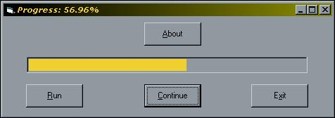



## Progress Bar with Timer

### Description

This code shows how to hook a progress bar up to a timer accurately. You can stop and resume from where you left off. I designed this code for a game I plan on designing. It shows the percentage and it is easy to change the max value and increments of the progress bar during run-time. Please feel free to use the code as you like. I would really appreciate it if you can leave some feedback and vote. Thanks!
 
### More Info
 

             |
---                |---
**Submitted On**   |2002-04-21 15:39:38
**By**             |[Nick Fantis](https://github.com/Planet-Source-Code/PSCIndex/blob/master/ByAuthor/nick-fantis.md)
**Level**          |Beginner
**User Rating**    |4.3 (13 globes from 3 users)
**Compatibility**  |VB 4\.0 \(32\-bit\), VB 5\.0, VB 6\.0
**Category**       |[Coding Standards](https://github.com/Planet-Source-Code/PSCIndex/blob/master/ByCategory/coding-standards__1-43.md)
**World**          |[Visual Basic](https://github.com/Planet-Source-Code/PSCIndex/blob/master/ByWorld/visual-basic.md)
**Archive File**   |[Progress\_B742524212002\.zip](https://github.com/Planet-Source-Code/nick-fantis-progress-bar-with-timer__1-34009/archive/master.zip)

